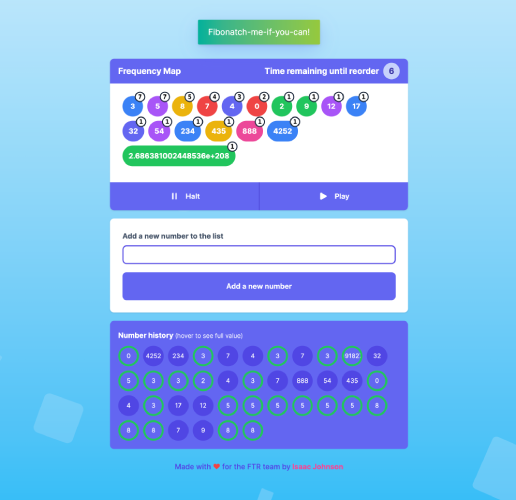

# FIBOTIMER

[](https://github.com/zackabrah/fibotimer/actions/workflows/ci.yml)

### Developed with ❤️ for the FTR team by Isaac Johnson ☺️

LIVE DEPLOYMENT - https://fibotimer.vercel.app/



Welcome to my fibbonacci timer inspired app, I tried to follow the requirement as closely as possible.

- The app will take a number input as a frequence in seconds which it will reorder and display all subsequent inputs.

- Inputs are upto a maximum of the 1000th number in the fibonacci sequence, assuming the first and second terms are 0 and 1.

- It displays an input history (hover to see the full number), and we re-order and identify which 'fib balls' have changed since the last interation.

- Halt and resume buttons stop and restart the timer respectively, there's also a countdown timer to show when the next re shuffle will take place.

- A toast message will be displayed when a fib number is entered. You can also see a green border in the number history which also identifies fib numbers.

- Tested upto the max 1000th number in the fibonacci sequence.

- If a user navigates to the /output route manually the timer will default to 10 seconds.

- I really tried to flex my UI and design skills in this solution, I hope you can appriciate.

- Have fun! And thank you so much for the oppurtunity to tackle this challenge, it was a lot of fun.

## Installation

To install and run Your App Name, follow these steps:

```
# Clone the repository
git clone https://github.com/your-repo-url.git

# Navigate to the project directory
cd fibotimer

# Install the dependencies
npm install

# Launch the app
npm run dev
```

## Deploy your own

[](https://vercel.com/new/clone?repository-url=https%3A%2F%2Fgithub.com%2Fzackabrah%2Ffibotimer)

## Docker

A docker docker container can be run with the following commands

```
# Build the docker image
docker build -t fibotimer-docker --build-arg NEXT_PUBLIC_CLIENTVAR=clientvar .

# Run the image
docker run -p 3000:3000 -e DATABASE_URL="database_url_goes_here" fibotimer-docker

# You can also use Docker Compose to build the image and run the container.
docker compose up
```

## Hardware issues

I had an issue with docker on my Mac M2 chip, here's what I had to do

- Check your client config file: $HOME/.docker/config.json. You should find something like this in that file:

```
"credsStore": "desktop"
```

or any other credStore. If it is not “desktop”, you can try to change it. This is what I use. I think the previous one was “osxkeychain”.

Some other ideas:

If you log in via SSH, you might need to unlock the keychain manually, however I don’t think that is what the error message indicates, but you can try it

```
security -v unlock-keychain ~/Library/Keychains/login.keychain-db
```

https://forums.docker.com/t/error-failed-to-solve-error-getting-credentials-err-exit-status-1-out/136124
